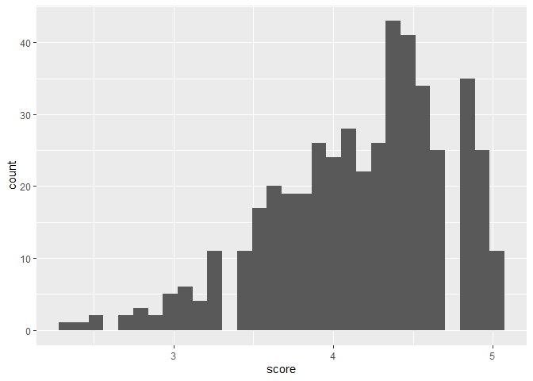
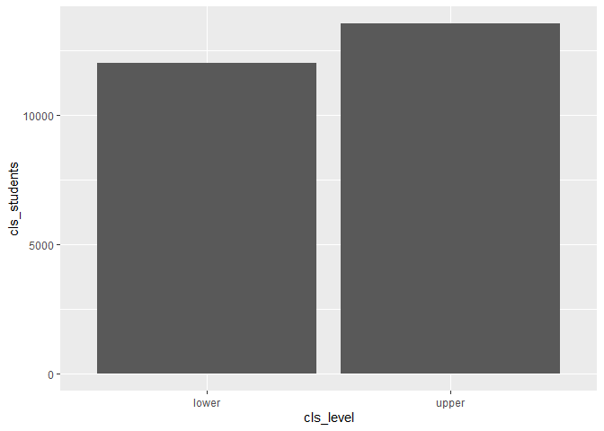
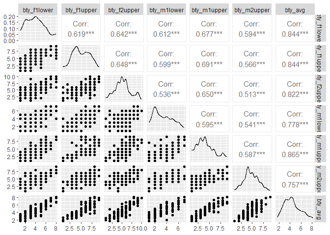
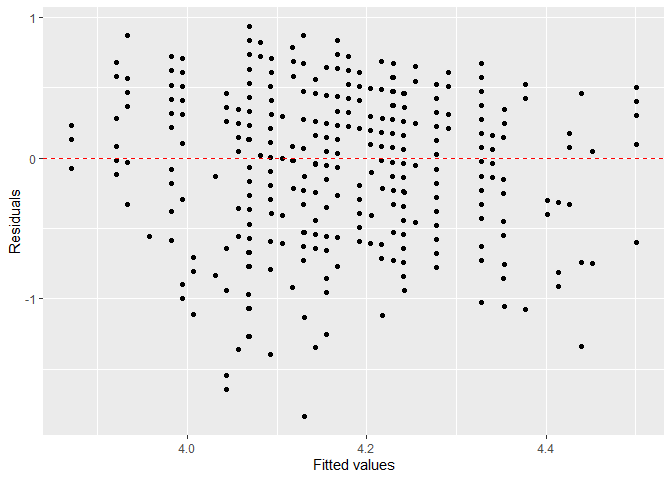
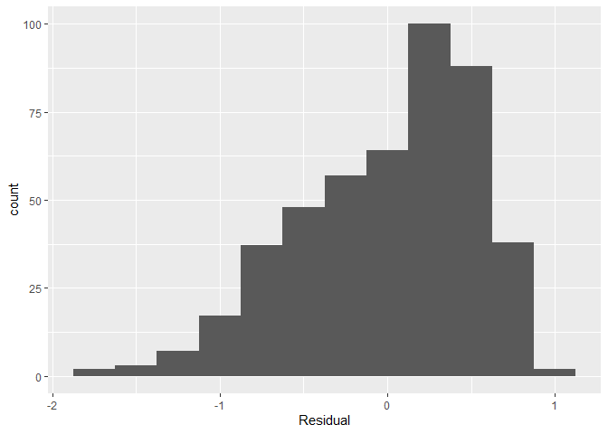

Activity 4 - Day 1
================

## Loading in the Data

``` r
evals <- readr::read_delim("https://www.openintro.org/data/tab-delimited/evals.txt")
```

    ## Rows: 463 Columns: 23
    ## -- Column specification --------------------------------------------------------
    ## Delimiter: "\t"
    ## chr  (9): rank, ethnicity, gender, language, cls_level, cls_profs, cls_credi...
    ## dbl (14): course_id, prof_id, score, age, cls_perc_eval, cls_did_eval, cls_s...
    ## 
    ## i Use `spec()` to retrieve the full column specification for this data.
    ## i Specify the column types or set `show_col_types = FALSE` to quiet this message.

``` r
evals %>%
  ggplot(aes(x = score)) +
  geom_histogram()
```

    ## `stat_bin()` using `bins = 30`. Pick better value with `binwidth`.

<!-- -->

1.  Observational study. They did not assign these individuals for the
    experiment and control for the professors looks. They observed the
    results afterwards.
2.  The data for score looks skewed to the left.
3.  See following code chunk. It looks like upper level classes have
    more students.

``` r
evals %>%
  ggplot(aes(x = cls_level, y = cls_students)) +
  geom_col()
```

<!-- -->

## Pairwise Relationships

``` r
evals %>%
  select(contains("bty")) %>%
  ggpairs()
```

<!-- -->

4.  They seem to all be positively correlated and have either a linear
    or curvalinear relationship.
5.  It does not make sense to have all of these variables in the same
    model because they would be describing the same variance.
6.  I would only include the bty_avg variable as it seems to be strongly
    correlated with all of the other variables. If I was to add another
    variable, it would have to be bty_m2upp as it is the least
    correlated with the bty_avg.

## Task 5 - One Quant, One Qual Variable

``` r
m_bty_gen <- lm(score ~ bty_avg + gender, data = evals)
tidy(m_bty_gen)
```

    ## # A tibble: 3 x 5
    ##   term        estimate std.error statistic   p.value
    ##   <chr>          <dbl>     <dbl>     <dbl>     <dbl>
    ## 1 (Intercept)   3.75      0.0847     44.3  6.23e-168
    ## 2 bty_avg       0.0742    0.0163      4.56 6.48e-  6
    ## 3 gendermale    0.172     0.0502      3.43 6.52e-  4

7.  See code chunk below. Overall, it looks skewed to the left. This
    could mean that a transformation on the data might yield a better
    model. Constant variance and linearity don’t seem to be much of an
    issue.

``` r
# obtain fitted values and residuals
m_bty_aug <- augment(m_bty_gen)

# plot fitted values and residuals
ggplot(data = m_bty_aug, aes(x = .fitted, y = .resid)) + 
  geom_point() +
  geom_hline(yintercept = 0, linetype = "dashed", color = "red") +
  xlab("Fitted values") +
  ylab("Residuals")
```

<!-- -->

``` r
ggplot(data = m_bty_aug, aes(x = .resid)) +
  geom_histogram(binwidth = 0.25) +
  xlab("Residual")
```

<!-- -->

8.  Both bty_avg and gender seem to be significant predictors of score.
9.  yhat = 3.919 + 0.07415\*bty_avg
10. males tend to receive higher score. You can tell because
    gendermale’s beta value is positive.

``` r
m_bty_rank <- lm(score ~ bty_avg + rank, data = evals)
tidy(m_bty_rank)
```

    ## # A tibble: 4 x 5
    ##   term             estimate std.error statistic   p.value
    ##   <chr>               <dbl>     <dbl>     <dbl>     <dbl>
    ## 1 (Intercept)        3.98      0.0908     43.9  2.92e-166
    ## 2 bty_avg            0.0678    0.0165      4.10 4.92e-  5
    ## 3 ranktenure track  -0.161     0.0740     -2.17 3.03e-  2
    ## 4 ranktenured       -0.126     0.0627     -2.01 4.45e-  2
